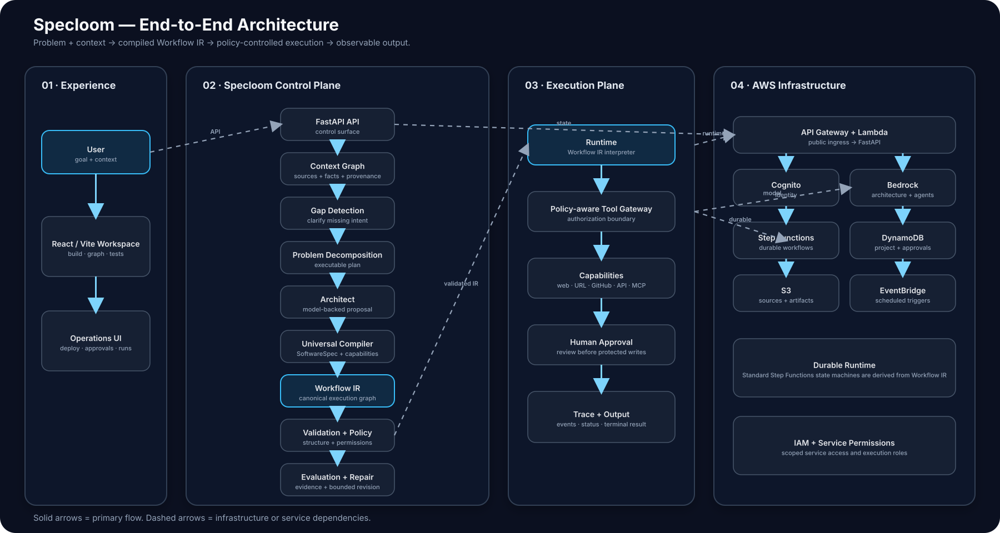
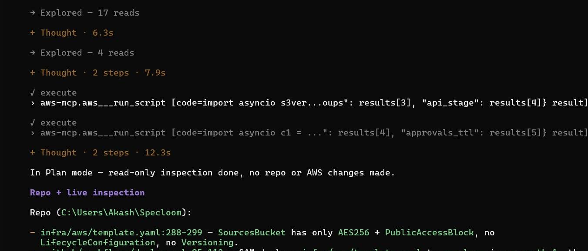
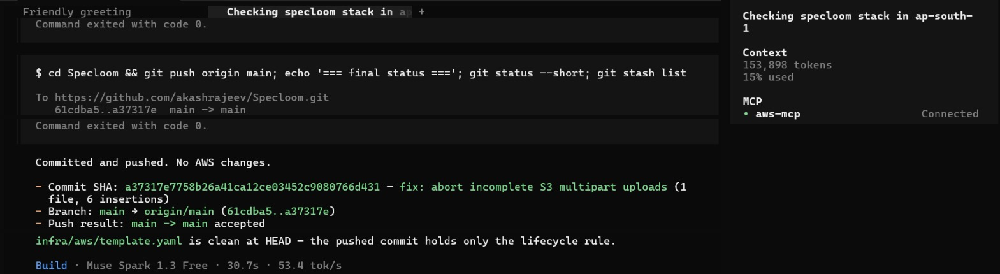
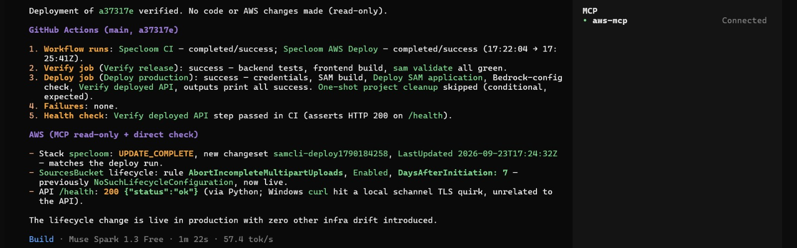

# Specloom

> **Give it a problem. Specloom architects the system.**

Specloom is an **agentic system compiler**. A user provides a goal and the context available to the system; Specloom turns that intent into a structured, validated, executable workflow and the artifacts required to operate it.

**Goal + Context → Understand → Architect → Validate → Evaluate → Repair → Deploy → Run**

The **Workflow IR** is the execution-control source of truth. Model output is treated as a proposal; deterministic compiler, capability, and policy checks decide whether that proposal is admissible.

---

## Live

| | |
|---|---|
| **App** | https://main.d1y0eafqal9vv0.amplifyapp.com/ |
| **API** | https://osqw6a29wd.execute-api.ap-south-1.amazonaws.com/Prod/health |
| **API docs** | https://osqw6a29wd.execute-api.ap-south-1.amazonaws.com/Prod/docs |

Everything runs on AWS in `ap-south-1`: API Gateway + Lambda, Step Functions for durable runs, DynamoDB for state, S3 for sources, EventBridge for schedules, and Amplify Hosting for the UI. The public deployment runs with sign-in turned off so judges can open it directly.

### Try it in 60 seconds

1. Open the app and pick **Live demo: book price watch**.
2. Click **Live demo**. Specloom reads three live product pages, then pauses at an approval gate.
3. Approve it (in the app, or from Telegram if the bot is connected).
4. The result card shows the verified table, and **Proof** links every line to the exact quote on the page it came from.

---

## Highlights

- **Plain English to a running workflow.** Describe the job; Specloom asks about anything that would change behavior, designs the Workflow IR, validates it, generates tests, and deploys it as a Step Functions state machine.
- **Build and run from your phone (Telegram).** `/new every day 8am read <pages> and summarize the prices` builds a workflow, asks when to run it if you didn't say, then sends the plan with its steps, test results and approval gates, plus **Create** / **Cancel** buttons. `/list`, `/run <n>`, `/pause <n>` and `/resume <n>` manage it. The bot only obeys the owner's chat ID and verifies Telegram's secret header.
- **Approvals on your phone.** Every `human_approval` step pauses the Step Functions execution (task token) and sends Approve / Reject buttons to Telegram. The run resumes the moment you tap.
- **Proof view.** Each line of an answer is matched against the pages the agent actually read. Lines get the exact quote with the numbers highlighted and a link that jumps to that text on the page. A value that is not on the page is flagged (for example "Not on the page: £49.99") instead of passing silently.
- **Grounded page reading.** Pages an agent is told to read are fetched before the model runs, so answers come from retrieved text, not from the model's memory or a skipped tool call.
- **Per-workflow schedules.** Each workflow has its own cron (IST by default), checked by a 5-minute EventBridge sweep. Scheduled runs are marked *changed* / *no change* against the previous run, so alerts only fire on real changes. Schedules can be paused and resumed from the UI or Telegram.
- **Quota-resilient models.** Every compiler and runtime step walks a provider chain: Amazon Bedrock Nova (home region, then US cross-region profiles), then Cloudflare Workers AI, Groq and Gemini when keys are configured. Throttled providers are skipped for a cool-down, and `/api/v1/config` shows which provider served the last call.
- **Self-cleaning.** An hourly job deletes Step Functions state machines left behind by deleted projects.

---

## What Specloom does

A system build can start with a problem such as:

> Create a support triage system that classifies customer requests, drafts helpful responses, and requires human review for urgent cases.

Specloom can then:

1. ingest context from text, URLs, PDFs, and repository sources;
2. extract requirements, constraints, entities, capabilities, examples, and provenance;
3. detect missing information that could change behavior, permissions, safety, or correctness;
4. decompose the problem into executable steps;
5. use the configured architect to produce Workflow IR;
6. bind workflow nodes to available or synthesized capabilities;
7. validate graph structure, requirements, constraints, tools, policies, loops, and outputs;
8. compile inspectable implementation, specification, and deployment artifacts;
9. generate requirement-oriented evaluation;
10. diagnose failures and apply bounded IR repairs;
11. deploy through the selected target;
12. execute the workflow and record an execution trace.

The key architectural boundary is:

**The model proposes architecture; the compiler and runtime control execution.**

---

# Architecture

## End-to-end system

The architecture is shown as a fixed SVG so its layout remains stable on GitHub and in exported documentation.

*Solid arrows show the primary flow. Dashed arrows show infrastructure or service dependencies.*

### Compiler lifecycle

~~~mermaid
flowchart LR
    GOAL[Goal + Context]
    GOAL --> UNDERSTAND[Understand]
    UNDERSTAND --> GAP{Blocking gap?}
    GAP -- yes --> CLARIFY[Clarify]
    CLARIFY --> UNDERSTAND
    GAP -- no --> DESIGN[Architect]
    DESIGN --> IR2[Workflow IR]
    IR2 --> CHECK[Deterministic validation]
    CHECK -- fail --> REPAIR[Bounded repair]
    REPAIR --> IR2
    CHECK -- pass --> EVAL[Evaluation]
    EVAL -- fail --> REPAIR
    EVAL -- pass --> BUILD[Compile artifacts]
    BUILD --> DEPLOY[Deploy]
    DEPLOY --> RUN2[Run]
    RUN2 --> OBS[Trace + output]
~~~

### Runtime safety boundary

~~~mermaid
flowchart LR
    IR3[Validated Workflow IR] --> EXEC2[Runtime]
    INPUT[Runtime input] --> EXEC2
    EXEC2 --> AGENT[Agent node]
    EXEC2 --> TOOL[Tool node]
    EXEC2 --> HUMAN[Human approval]
    EXEC2 --> OUT[Output]
    AGENT --> MODEL[Bedrock model]
    TOOL --> GATE2[Tool Gateway]
    GATE2 --> READ[Read capability]
    GATE2 --> WRITE[Write capability]
    WRITE --> POLICY[Policy + approval]
    HUMAN --> POLICY
    POLICY --> WRITE
~~~

### Architectural invariant

**Model-generated intent is not equivalent to permission.**

External effects are bounded by schema validation, graph validation, capability binding, tool permissions, policy references, approval gates, and bounded execution controls.

See [docs/ARCHITECTURE.md](docs/ARCHITECTURE.md) for the implementation-level breakdown.

---

# Core concepts

### Context Graph

The Context Graph is Specloom's normalized representation of what the system knows about a project:

- sources;
- requirements;
- constraints;
- entities;
- capabilities;
- examples;
- provenance;
- problem decomposition.

Source material is ingested and normalized before architecture generation. Requirements and constraints retain provenance back to source material where available.

### Workflow IR

Workflow IR describes what the system will do.

| Node | Purpose |
|---|---|
| trigger | manual, scheduled, webhook, or event start |
| agent | bounded model reasoning with explicit tools/output |
| tool | deterministic external capability |
| condition | deterministic branch |
| parallel | fan-out/fan-in |
| loop | bounded iteration |
| human_approval | explicit human decision point |
| output | terminal result, artifact, notification, or webhook |

Schema: [schemas/workflow-ir.schema.json](schemas/workflow-ir.schema.json)

### SoftwareSpec

SoftwareSpec is a provider-neutral software architecture representation produced by the universal compiler. It describes services, required capabilities, synthesized capabilities, data, environment, implementation information, and deployment targets.

Schema: [schemas/software-spec.schema.json](schemas/software-spec.schema.json)

### Capability binding

Capabilities can come from:

- registered native tools;
- configured APIs;
- OpenAPI definitions;
- read-only MCP servers;
- synthesized external-service contracts.

Credentials and provider-specific provisioning values stay outside model prompts and generated source.

---

# Repository structure

~~~text
Specloom/
├── backend/
│   ├── agents/          # Architects and reviewers
│   ├── api/             # FastAPI control-plane endpoints
│   ├── capabilities/    # Capability contracts and binding logic
│   ├── compiler/        # Universal software/compiler pipeline
│   ├── context/         # Ingestion, analysis, gaps, provenance
│   ├── evaluation/      # Test generation and evaluation
│   ├── runtime/         # Local, Bedrock, SageMaker, durable execution
│   ├── security/        # Authentication and workspace isolation
│   ├── storage/         # Memory and AWS persistence
│   ├── tools/           # Registry, gateway, adapters, APIs, MCP
│   └── workflow/        # Workflow IR, compilation, validation
├── frontend/
│   ├── src/App.tsx      # Main engineering workspace
│   ├── src/api.ts       # Typed API client
│   └── src/components/  # Build, context, run, deploy, provenance UI
├── schemas/             # Workflow IR, Context Graph, SoftwareSpec
├── examples/            # Workflow fixtures and reference systems
├── infra/
│   ├── aws/             # Canonical AWS SAM control plane
│   └── agentcore/       # AgentCore runtime entrypoint/scaffold
├── tests/               # Backend/compiler/runtime/security tests
├── docs/                # Architecture and operational documentation
├── requirements.txt     # Root Python dependency entrypoint
├── samconfig.toml       # SAM deployment defaults
└── Makefile             # Development helpers
~~~

---

# Quick start

## Prerequisites

Recommended versions:

- Python **3.11**;
- Node.js/npm (CI currently uses Node 24);
- Git.

AWS is **not required** for deterministic local development.

## 1. Clone

~~~bash
git clone https://github.com/akashrajeev/Specloom.git
cd Specloom
~~~

## 2. Create a Python environment

### Linux / macOS / WSL

~~~bash
python3.11 -m venv .venv
source .venv/bin/activate
python -m pip install --upgrade pip
python -m pip install -r backend/requirements.txt
~~~

### Windows PowerShell

~~~powershell
py -3.11 -m venv .venv
.\.venv\Scripts\Activate.ps1
python -m pip install --upgrade pip
python -m pip install -r backend/requirements.txt
~~~

## 3. Run the backend

From the repository root:

~~~bash
uvicorn backend.main:app --reload --port 8000
~~~

Health check:

~~~bash
curl http://localhost:8000/health
~~~

Expected:

~~~json
{"status":"ok"}
~~~

API documentation:

- http://localhost:8000/docs
- http://localhost:8000/redoc

## 4. Run the frontend

Open a second terminal:

~~~bash
cd frontend
npm install
npm run dev
~~~

Open the Vite URL printed by the dev server, normally:

~~~text
http://localhost:5173
~~~

The frontend defaults to the backend at http://localhost:8000. Set VITE_API_BASE_URL to point at another API.

---

# Local development

For a fully local deterministic configuration:

~~~bash
export SPECL00M_ARCHITECT_MODE=showcase
export SPECL00M_CONTEXT_MODE=deterministic
export SPECL00M_RUNTIME_MODE=local
export SPECL00M_STORAGE_MODE=memory
~~~

PowerShell:

~~~powershell
$env:SPECL00M_ARCHITECT_MODE="showcase"
$env:SPECL00M_CONTEXT_MODE="deterministic"
$env:SPECL00M_RUNTIME_MODE="local"
$env:SPECL00M_STORAGE_MODE="memory"
~~~

These settings provide a repeatable local engineering path without AWS credentials.

The generic production architecture path is model-backed.

---

# Bedrock-backed mode

Install the AWS/model dependencies:

~~~bash
python -m pip install -r backend/requirements-aws.txt
~~~

Verify credentials:

~~~bash
aws sts get-caller-identity
~~~

Configure:

~~~bash
export SPECL00M_ARCHITECT_MODE=bedrock
export SPECL00M_CONTEXT_MODE=bedrock
export SPECL00M_RUNTIME_MODE=bedrock
export SPECL00M_STORAGE_MODE=memory
export SPECL00M_BEDROCK_MODEL_ID=amazon.nova-lite-v1:0
export SPECL00M_ALLOWED_BEDROCK_MODELS=amazon.nova-lite-v1:0
export AWS_REGION=ap-south-1
~~~

The Bedrock architect produces Workflow IR through the Strands SDK. Specloom then applies deterministic workflow validation, architecture coverage validation, and capability-binding validation.

## Optional integrations

Set these as SAM parameters (or environment variables locally). Keys never go into prompts or generated code.

| Variable | Purpose |
|---|---|
| `SPECL00M_TELEGRAM_BOT_TOKEN`, `SPECL00M_TELEGRAM_CHAT_ID` | Telegram approvals, alerts and the `/new` bot. Only this chat ID is obeyed. Run `POST /api/v1/telegram/setup` once after deploying. |
| `SPECL00M_CLOUDFLARE_ACCOUNT_ID`, `SPECL00M_CLOUDFLARE_API_TOKEN` | Cloudflare Workers AI fallback models |
| `SPECL00M_GROQ_API_KEY` | Groq fallback models |
| `SPECL00M_FALLBACK_LLM_API_KEY` | Gemini (or other OpenAI-compatible) fallback |
| `SPECL00M_APP_URL` | Link back to the app in Telegram messages |

---

# AI coding agent + AWS Agent Toolkit

Specloom was built with an AI coding agent (OpenCode) connected to the AWS account through the AWS Agent Toolkit and the AWS MCP Server. The agent reads live AWS state over MCP, changes the code and infrastructure-as-code in this repository, runs the tests, and ships through GitHub Actions + SAM. The verified run below is the documented proof of that connection.

Specloom can be developed and operated with an MCP-compatible AI coding agent connected to AWS through the **AWS Agent Toolkit**.

The AWS Agent Toolkit provides the managed **AWS MCP Server**, curated AWS skills, and guidance for AI coding agents. The AWS MCP Server can expose authenticated AWS API operations using the agent's existing IAM credentials. AWS documents the toolkit as compatible with MCP-based coding agents and recommends SigV4/MCP proxy authentication for terminal or IDE-based agents.

## OpenCode setup

Install and authenticate the AWS CLI, then run:

~~~powershell
aws login
aws configure agent-toolkit
~~~

The Agent Toolkit setup can detect installed coding agents, install the AWS skills, and configure the AWS MCP Server connection. AWS documents `aws configure agent-toolkit` as the CLI setup path for this workflow.

For OpenCode V2, MCP servers are configured under `mcp.servers`. Verify the connection from OpenCode with:

~~~text
/mcps
~~~

Then perform a read-only test such as:

~~~text
What AWS Regions are available?
~~~

AWS documents this as a basic AWS MCP connectivity test. For terminal/IDE agents, the AWS MCP setup can use the MCP proxy with SigV4 authentication and an `AWS_REGION` metadata value for the default AWS operation region.

## Specloom AWS workflow

Once connected, the coding agent can inspect the live Specloom deployment through AWS MCP:

~~~text
OpenCode
   │
   ▼
AWS Agent Toolkit / AWS MCP Server
   │
   ├── CloudFormation
   ├── Lambda
   ├── API Gateway
   ├── DynamoDB
   ├── S3
   ├── Cognito
   └── Step Functions
            │
            ▼
       Specloom AWS
~~~

For infrastructure changes, prefer **infrastructure-as-code plus the existing CI/CD pipeline** rather than direct production writes. The agent can inspect live AWS resources through MCP, modify the repository, run tests, and use the repository's GitHub Actions/SAM deployment path.

The AWS MCP Server provides authenticated AWS API tooling, while IAM permissions determine which operations the agent can perform. AWS also documents CloudTrail audit visibility for MCP API activity.

## Verified production workflow

This integration has been exercised end-to-end with the deployed Specloom control plane:

1. OpenCode inspected the live `specloom` CloudFormation stack through AWS MCP using a read-only AWS API call.
2. The agent identified a real infrastructure gap: the S3 source bucket had no lifecycle rule for incomplete multipart uploads.
3. The agent implemented `AbortIncompleteMultipartUploads` with `DaysAfterInitiation: 7` in `infra/aws/template.yaml`.
4. The backend test suite passed with **209 tests** and the frontend production build passed.
5. GitHub Actions ran SAM validation/build/deployment successfully.
6. The deployed CloudFormation stack reached `UPDATE_COMPLETE`, the API health check returned HTTP 200, and the live S3 bucket exposed the new 7-day lifecycle rule.

Screenshots from that session (OpenCode, with the `aws-mcp` server connected):

**1. Inspect.** The agent reads the live stack over AWS MCP in plan mode and finds that `SourcesBucket` has no lifecycle rule. No changes are made at this step.

**2. Commit and push.** The fix is committed as `a37317e` (`fix: abort incomplete S3 multipart uploads`, 1 file, 6 insertions) and pushed to `main`.

**3. Deploy and verify.** GitHub Actions deploys the change, and the agent confirms over AWS MCP that the stack is `UPDATE_COMPLETE`, the lifecycle rule is live, and `/health` returns 200.

The resulting workflow is:

~~~text
Inspect live AWS
      ↓
Plan the change
      ↓
Modify infrastructure-as-code
      ↓
Run tests/build/validation
      ↓
Push to GitHub
      ↓
GitHub Actions + SAM deploy
      ↓
Verify live AWS state
~~~

## Security

Use a dedicated least-privilege IAM identity or role for AI-agent access. Do not give a coding agent long-lived root credentials or commit AWS secrets to the repository.

The AWS Agent Toolkit provides IAM-aware access, AWS skills, and recommended rules for safer agent workflows.

---

# API overview

The FastAPI control plane exposes the main lifecycle under /api/v1.

| Area | Endpoint |
|---|---|
| Health | GET /health |
| Config | GET /api/v1/config |
| Example workflow | GET /api/v1/workflow/example |
| Project | GET /api/v1/projects/{id} |
| Build | POST /api/v1/projects/{id}/build |
| Autonomous build | POST /api/v1/projects/{id}/autobuild |
| Context | GET /api/v1/projects/{id}/context |
| Add text context | POST /api/v1/projects/{id}/context/text |
| Add URL context | POST /api/v1/projects/{id}/context/url |
| Add file context | POST /api/v1/projects/{id}/context/file |
| Evaluate | POST /api/v1/projects/{id}/evaluate |
| Repair | POST /api/v1/projects/{id}/repair |
| Apply repair | POST /api/v1/projects/{id}/repair/apply |
| Runtime | POST /api/v1/projects/{id}/run |
| Trigger | POST /api/v1/projects/{id}/trigger |
| Run history | GET /api/v1/projects/{id}/runs |
| Run detail | GET /api/v1/projects/{id}/runs/{run_id} |
| Durable approvals | GET /api/v1/projects/{id}/durable/approvals |
| Workflow versions | GET /api/v1/projects/{id}/versions |
| Node mode | PATCH /api/v1/projects/{id}/nodes/{node_id}/mode |
| Provenance | GET /api/v1/projects/{id}/provenance |
| Artifacts | GET /api/v1/projects/{id}/artifacts |
| Deployment plan | GET /api/v1/projects/{id}/deploy/plan |
| Async build | POST /api/v1/projects/{id}/build/async |
| Build job status | GET /api/v1/projects/{id}/build/jobs/{run_id} |
| Pause / resume schedule | POST /api/v1/projects/{id}/schedule |
| Clean up orphaned state machines | POST /api/v1/projects/{id}/ops/cleanup-orphans?dry_run=true |
| Live demo (phone approval) | POST /api/v1/demo/phone-approval |
| Telegram status | GET /api/v1/telegram/status |
| Telegram webhook + commands setup | POST /api/v1/telegram/setup |
| Telegram webhook | POST /api/v1/telegram/webhook |

The authoritative request/response contract is the FastAPI OpenAPI schema available at /docs.

See [docs/API.md](docs/API.md) for the endpoint-level reference.

---

# AWS deployment

The **canonical production SAM stack** is:

~~~text
infra/aws/template.yaml
~~~

Deploy it with:

~~~bash
./infra/aws/deploy.sh
~~~

The compatibility wrapper:

~~~bash
./scripts/deploy-aws.sh
~~~

delegates to the same canonical stack.

The SAM stack provisions:

- API Gateway;
- Lambda + Mangum;
- Cognito User Pool and client;
- DynamoDB project state;
- DynamoDB durable approvals;
- DynamoDB build jobs (async builds polled across Lambda invocations);
- S3 source/artifact storage;
- EventBridge rules: a 5-minute schedule sweep for per-workflow crons, plus the daily researchhunter run at 08:00 IST;
- IAM permissions for Bedrock, SageMaker, Step Functions, DynamoDB, and S3;
- the durable Step Functions execution role.

The application can create/update a Standard Step Functions state machine for a project at runtime. The state machine is derived from Workflow IR rather than being one fixed workflow.

Read deployment outputs:

~~~bash
aws cloudformation describe-stacks \
  --stack-name specloom \
  --query 'Stacks[0].Outputs' \
  --output table
~~~

Use the ApiUrl output as VITE_API_BASE_URL for the frontend.

See [docs/AWS.md](docs/AWS.md) for the deployment runbook.

> **Deployment note:** the repository is deployment-ready, but a successful deployment still depends on the target AWS account, credentials, region, IAM permissions, and enabled model/service access.

---

# Security and execution policy

Specloom treats external capabilities as an explicit boundary.

- Tools are registered and allowlisted.
- Side-effecting tools are explicitly marked.
- Write-capable tool nodes require policy references.
- Human approval nodes can pause workflows before writes.
- Agent nodes cannot directly use side-effecting capabilities.
- Loops have explicit maximum iterations.
- Credentials are loaded from environment/configuration rather than generated into prompts.
- Cognito/workspace authentication is available (`AuthMode=cognito` is the template default); the public demo deployment runs with `AuthMode=off`.
- Telegram commands and approval taps are accepted only from the configured chat ID, with Telegram's secret-token header checked on every webhook call.
- Workflows built from Telegram stay paused until the owner taps **Create**.
- Workflow repair is bounded to IR/configuration changes.
- Live HTTP adapters reject URLs resolving to non-public address ranges.

---

# Testing

Backend:

~~~bash
python -m pytest -q
~~~

Frontend:

~~~bash
cd frontend
npm run build
~~~

The backend suite currently has 235 tests. CI runs both on pull requests and pushes to main, and every push to `main` deploys the SAM stack through GitHub Actions and rebuilds the Amplify frontend.

Backend CI uses Python 3.11 and deterministic local settings so the suite does not require an AWS account.

---

# Documentation

- [Architecture](docs/ARCHITECTURE.md)
- [Development](docs/DEVELOPMENT.md)
- [API Reference](docs/API.md)
- [AWS Deployment](docs/AWS.md)
- [Product](docs/PRODUCT.md)
- [Workflow IR schema](schemas/workflow-ir.schema.json)
- [SoftwareSpec schema](schemas/software-spec.schema.json)
- [Context Graph schema](schemas/context-graph.schema.json)

---

# Implementation status

### Implemented

- Workflow IR v0.1 + JSON Schema;
- Context Graph + provenance;
- text, URL, PDF, and GitHub repository context paths;
- deterministic and Bedrock-backed context analysis;
- context gap detection;
- problem decomposition;
- capability discovery, binding, and synthesis;
- deterministic workflow and architecture validation;
- Strands + Bedrock architecture path;
- Strands + Bedrock runtime runner;
- live web, URL, and GitHub adapters;
- configured API/OpenAPI capability paths;
- read-only MCP capability boundary;
- requirement-oriented test generation/evaluation;
- bounded IR repair;
- generated implementation/specification/deployment artifacts;
- artifact retrieval and immutable snapshots;
- memory and AWS persistence adapters;
- durable Step Functions execution manager;
- durable approval persistence;
- optional Cognito/workspace authentication;
- React/Vite engineering workspace;
- system graph, context, tests, deploy, provenance, versions, run history, and approvals UI;
- AWS SAM control plane;
- Amplify frontend configuration;
- GitHub Actions CI and continuous deployment to AWS;
- Telegram bot: `/new`, `/list`, `/run`, `/pause`, `/resume`, phone approvals and change alerts;
- proof view linking each output line to its source quote;
- per-workflow cron schedules with change detection and pause/resume;
- async builds with durable job status;
- multi-provider model chain (Bedrock, Cloudflare Workers AI, Groq, Gemini);
- live demo with phone approval;
- hourly cleanup of orphaned Step Functions state machines.

### Environment-dependent

- real Bedrock architecture/runtime requires AWS credentials and model access;
- Cognito mode requires a valid User Pool issuer/client;
- durable Step Functions execution needs the configured IAM roles/functions;
- live GitHub writes need a GitHub token and repository configuration (the researchhunter example's GitHub step is simulated without one);
- Telegram features need a bot token and chat ID;
- configured third-party APIs require their own endpoint/authentication values.

---

# Design principles

### One canonical graph

Workflow IR is the execution graph. The frontend does not maintain a second workflow schema.

### Probability at the edge, determinism at the boundary

Models handle ambiguous language and architecture proposals. Validators, capability binding, and policy logic control admissible execution.

### Provenance is first-class

Requirements, constraints, and generated nodes can be traced back to contextual evidence.

### Repair the representation

The repair loop prefers constrained IR/configuration changes and creates new workflow versions instead of unrestricted self-modifying source.

### Production path first

The same compiler, policy boundary, runtime, persistence, and observability concepts are used from local development through AWS deployment.

---

# License

No open-source license is currently declared in the repository. Check the project owner's distribution terms before redistributing the source.
